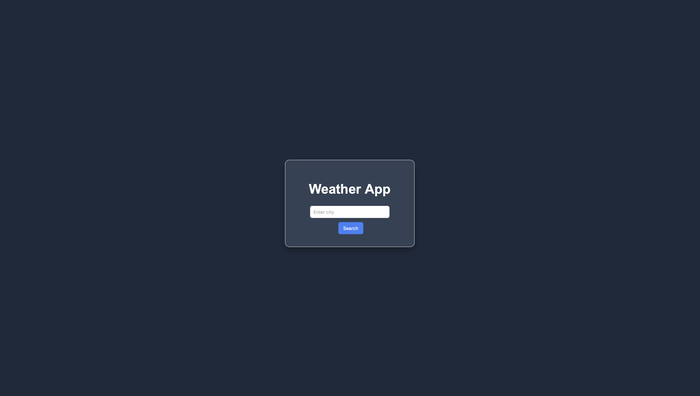

## Weather App

This is a simple **Weather App** that lets you search for the current weather in any city using the OpenWeatherMap API. It shows:

- **City name**
- **Temperature in °C**
- **Short description of the weather**
- **Weather icon**
- **Dynamic background color** that changes based on the weather (clear, cloudy, rainy, snowy, or default).

### Live Demo

[](https://Garychamp.github.io/weather-app/)

### App Image



### Project Structure

- **index.html**: Main HTML file that defines the app layout (`input`, `button`, and weather result area).
- **style.css**: Styles for the app container, input, button, and dynamic look & feel.
- **script.js**: JavaScript logic that:
  - Reads the city from the input field
  - Calls the OpenWeatherMap API
  - Handles errors (e.g. city not found, network problems)
  - Updates the UI and page background based on the result

### Technologies Used

- **HTML5**
- **CSS3**
- **Vanilla JavaScript (ES6+)**
- **OpenWeatherMap API**

### Getting Started

1. **Clone or download** this project into a folder (e.g. `Weather-App`).
2. Open the folder in your editor (Cursor / VS Code).
3. Make sure you have a modern browser (Chrome, Edge, Firefox, Safari).

You can run it in two main ways:

- **Option 1 – Open directly**  
  Open `index.html` in your browser (double‑click or use "Open With").
  - Note: Some browsers block `fetch` from local files. If the weather does not load, use Option 2.

- **Option 2 – Use a local server (recommended)**  
  For example, with Python installed:

  ```bash
  # From inside the Weather-App folder
  python -m http.server 8000
  ```

  Then open `http://localhost:8000` in your browser and click on `index.html`.

### API Key Configuration

This app uses the **OpenWeatherMap** API. In `script.js`, there is a line:

```javascript
const apiKey = "778fb5f32120a15fb4fe652ae73486cc"; // <-- Replace with your actual API key
```

- **Create your own API key** at [OpenWeatherMap](https://openweathermap.org/api).
- Replace the placeholder string with **your own key**.
- For security, never commit real, private API keys to a public repository.

### How to Use

1. Start the app in your browser.
2. Type the **city name** in the input box (e.g. `London`, `New York`).
3. Click **Search** or press **Enter**.
4. The app will display:
   - City name
   - Temperature in °C
   - Weather description and icon
   - The page background will change color based on the weather.

If the city is not found, you will see **"City not found"** and the background resets to the default dark color.

### Error Handling

- If the city does not exist or is mistyped, the API returns a `404` and the app displays **"City not found"**.
- If something unexpected happens (network errors, etc.), the app shows **"Something went wrong"** and logs the error to the browser console.

### Possible Improvements

- Add **input validation** (e.g. prevent empty searches).
- Show **more details** like humidity, wind speed, and feels-like temperature.
- Add **unit toggle** between °C and °F.
- Improve **mobile responsiveness** and overall styling.
- Hide the API key using a small backend or environment variables if deployed.
